# ProWallet

Aplicación Android de gestión de gastos personales desarrollada como proyecto universitario para la materia de Desarrollo de Aplicaciones Móviles — **UNDEF**.

## Integrantes

| Nombre | GitHub |
|---|---|
| Joaquin Contreras | [@joacoContreras](https://github.com/joacoContreras) |
| Martin Gonzalez | [@mgonzalez309-dev](https://github.com/mgonzalez309-dev) |

---

## Funcionalidades principales

### Autenticación y sesión
- **Registro e inicio de sesión** con contraseñas hasheadas con **PBKDF2WithHmacSHA256** (salt aleatorio, 65.536 iteraciones)
- **Sesión persistida** entre reinicios con DataStore Preferences
- **Autenticación biométrica** (huella dactilar) en Splash y configurable desde Ajustes vía `BiometricPrompt`
- **Recuperación de contraseña** con flujo de verificación de código de 6 dígitos

### Registro de compras
- **Nueva compra** con tienda, fecha, hora, categoría y lista de productos — guardada en Room con transacción atómica
- **Captura de ticket con OCR** (ML Kit TextRecognition) + **parsing con IA** (Groq `llama-3.3-70b-versatile`) que detecta tienda, fecha, ítems y total; diálogo de confirmación antes de auto-fill
- **Fallback de parsing local** (heurístico regex) si no hay Groq API key configurada
- **Ubicación de compra** capturada automáticamente con GPS (FusedLocationProviderClient)

### Historial y análisis
- **Historial completo** de compras con **filtros avanzados**: por tienda, categoría, rango de fechas y rango de monto; filtrado reactivo en tiempo real
- **Exportación a CSV** real: genera archivo `.csv` en `cacheDir`, lo comparte vía FileProvider como `text/csv` (compatible con Google Drive, Gmail, Excel)
- **Estadísticas mensuales**: gasto total, ticket promedio, gráfico de tendencia 6 meses, productos más comprados
- **Top tiendas**: ranking de comercios por gasto total del mes
- **Inflación personal**: comparación de precios propios entre períodos

### Comparación de precios
- **Comparativa de precios** en el detalle de cada compra vía **Precios Claros** (API gubernamental argentina, endpoint CloudFront) usando la ubicación GPS del dispositivo
- Algoritmo de **scoring semántico** por ratio de palabras coincidentes y popularidad de sucursales para seleccionar el producto más representativo
- **Cache local en Room** con TTL de 24 horas; fallback a cache si la red falla
- Muestra rango precio mínimo–máximo con badge **Buen precio / Precio justo / Precio alto**

### Asistente financiero (Chat IA)
- **Chat con Groq API** (`llama-3.3-70b-versatile`): si hay API key configurada, responde en lenguaje natural con contexto financiero real (presupuesto, ingresos, top categorías, gasto del mes, compra más cara, mes anterior)
- **Motor local de keywords** cuando no hay API key: cubre consultas de gasto más caro, comparación intermensual, recomendaciones de ahorro, gasto por tienda, estado del presupuesto, resumen semanal y top categorías — todos calculados sobre datos reales de Room
- **Indicador de thinking** (spinner) mientras Groq procesa la respuesta
- FAB flotante y arrastrable disponible en todas las pantallas principales

### Notificaciones
- **Alerta de presupuesto** (sistema Android): notificación push cuando el gasto mensual supera el 80% del presupuesto configurado
- **Recordatorio semanal** (WorkManager, periodo 7 días): calcula gasto real de los últimos 7 días y del mes desde Room, muestra resumen en la barra de notificaciones
- **Feed de notificaciones in-app**: alertas calculadas desde Room — presupuesto excedido, top categoría del mes, compra más grande, recordatorio de ahorro

### Ahorro automático
- **Calculadora de ahorro**: configura porcentaje del ingreso o monto fijo con frecuencia mensual/quincenal/semanal
- **Meta de ahorro real**: define objetivo (monto + plazo en meses), persiste en DataStore con timestamp de inicio
- **Progreso calculado desde datos reales**: `monthlySavingCapacity = ingreso − gasto actual de Room`; `progressFraction = capacidad × meses_transcurridos / objetivo`; badge **on-track / off-track** según capacidad actual
- Top 3 categorías del mes con sus montos mostradas junto al progreso

### Otros
- **Gestión de categorías** con AlertDialog de CRUD (agregar, editar, eliminar) — dropdown actualizado en tiempo real
- **Presupuesto e ingreso mensual** configurables, persistidos en DataStore
- **Cuentas vinculadas** y **gastos fijos** con CRUD completo
- **Compartir compra** vía Intent `ACTION_SEND` (WhatsApp, Gmail, etc.)
- **Contacto por email** vía Intent `ACTION_SENDTO`
- **Dark mode** configurable desde Ajustes

---

## Descargar APK

**[⬇ Descargar ProWallet v1.0.0](https://github.com/joacoContreras/ProWallet/releases/tag/v1.0.0)**

> Requiere Android 8.0+ (API 26). Activar *"Instalar desde fuentes desconocidas"* antes de instalar.

---

## Capturas de pantalla

### Flujo de autenticación y registro
| Splash | Login | Registro | Registro Exitoso |
|---|---|---|---|
| 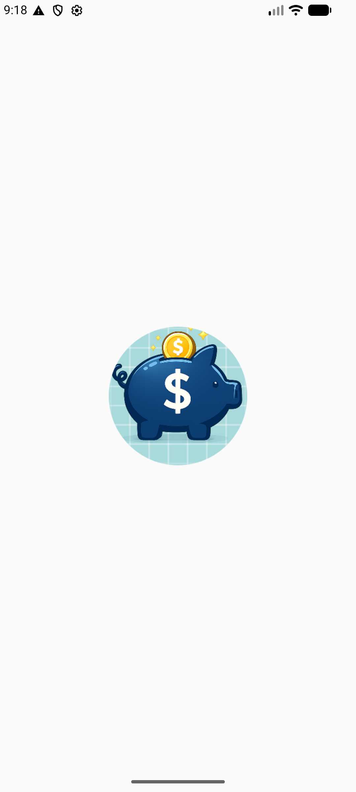 | 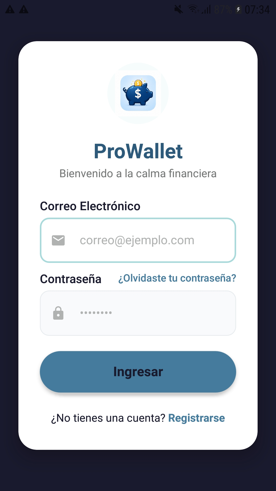 | 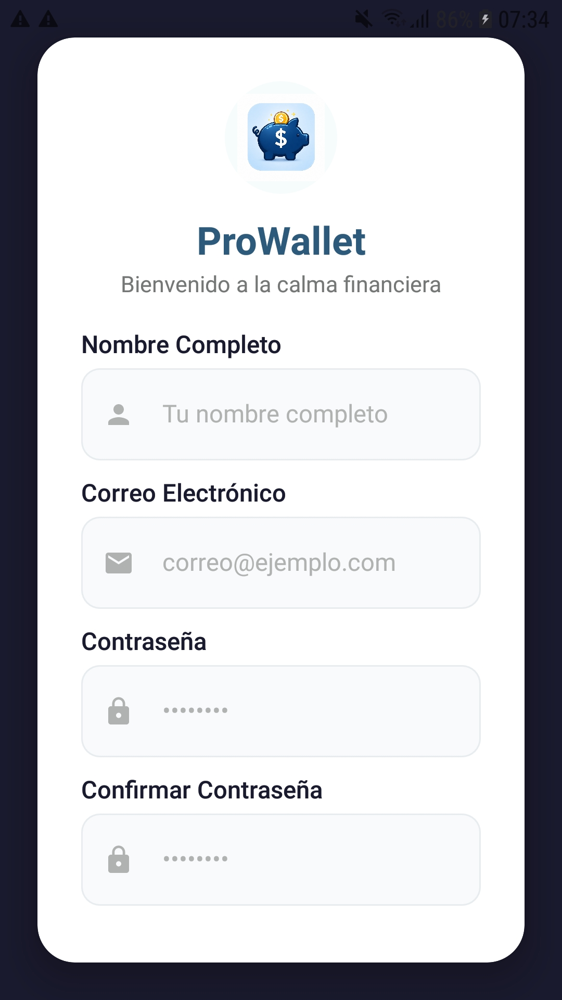 | 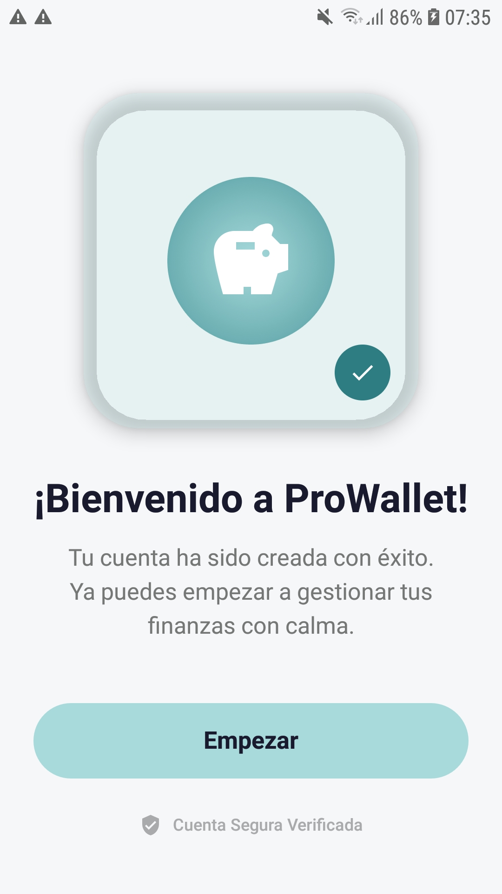 |

### Dashboard y Compras
| Dashboard (Home) | Nueva Compra | Compra Exitosa | Notificaciones |
|---|---|---|---|
| 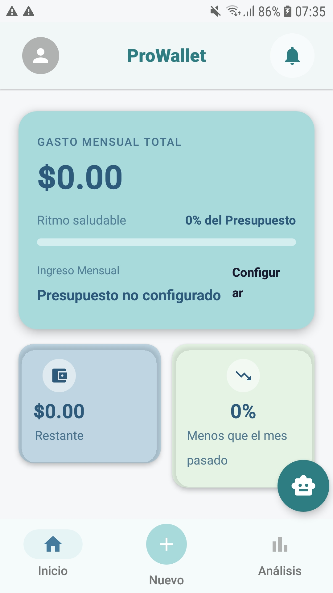 | 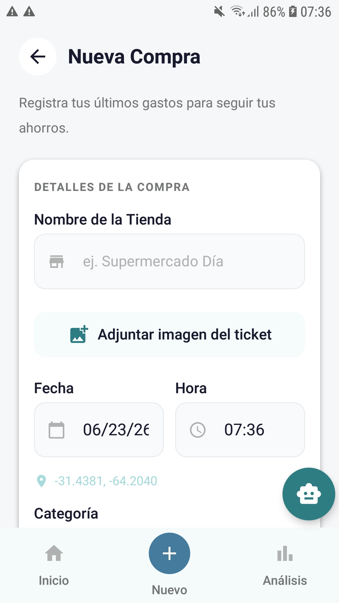 | 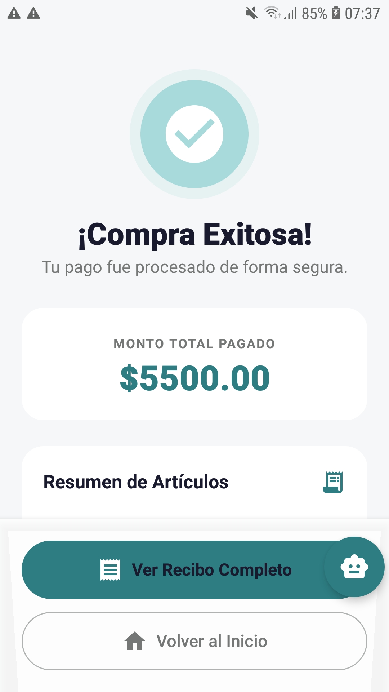 | 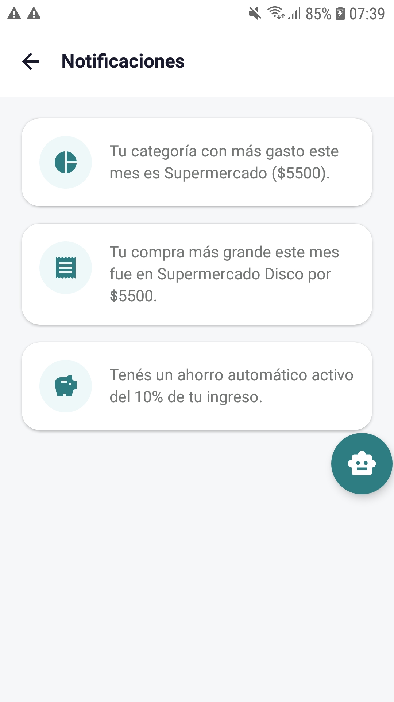 |

### Estadísticas, Perfil y Configuración
| Estadísticas | Tendencias | Top Tiendas | Perfil | Configuración |
|---|---|---|---|---|
| 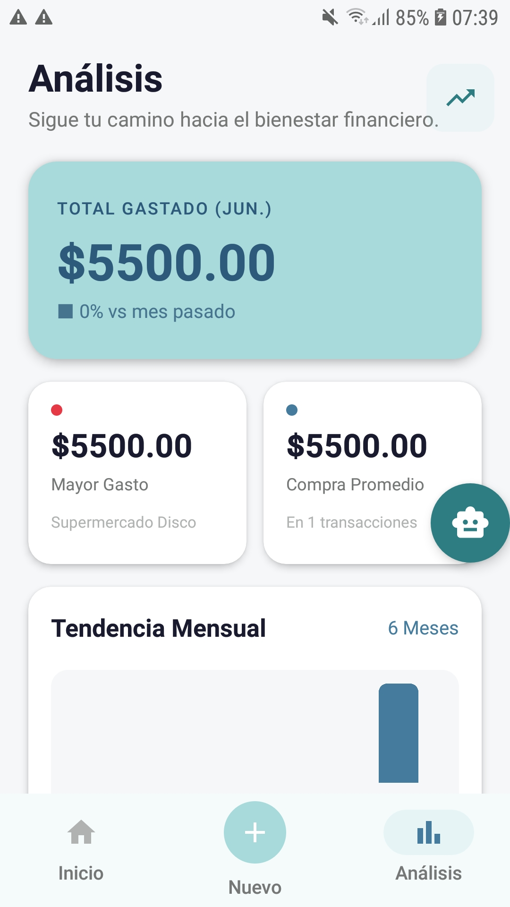 | 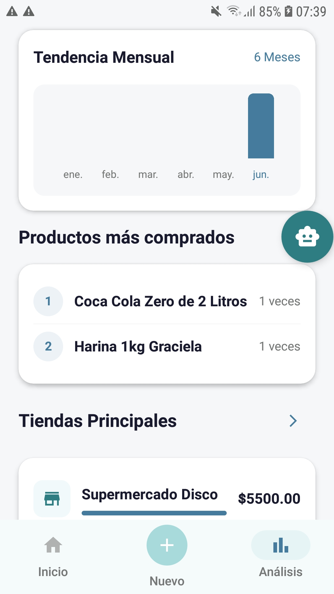 | 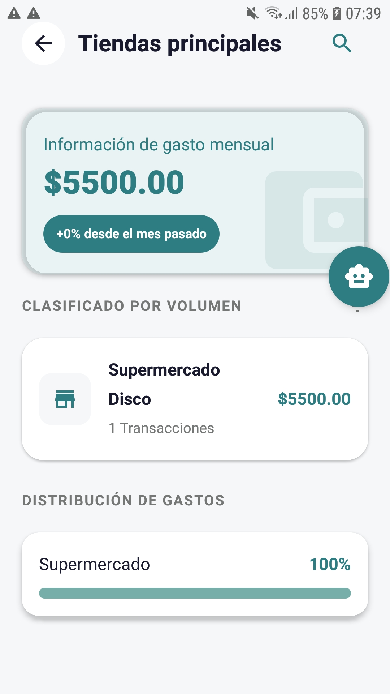 | 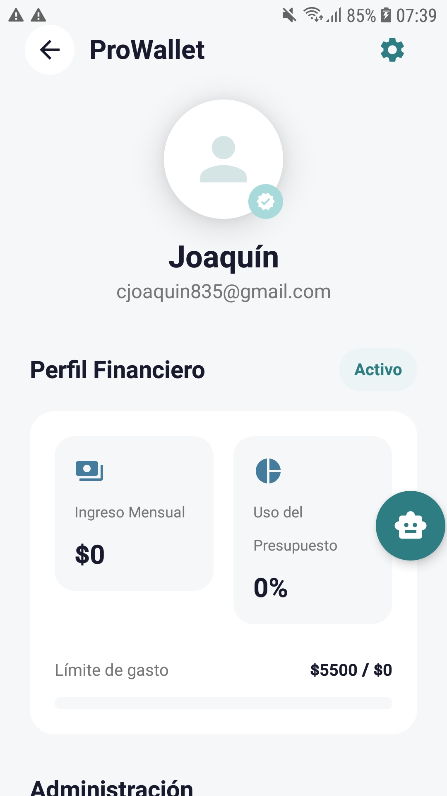 | 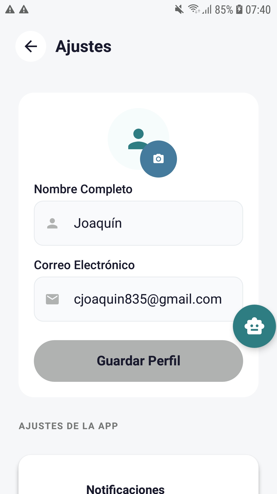 |

---

## Stack tecnológico

| Tecnología | Uso |
|---|---|
| **Kotlin** + **Jetpack Compose** (Material 3) | UI declarativa |
| **Navigation Compose** | Navegación entre 25 pantallas |
| **ViewModel** + **StateFlow** | Arquitectura MVVM, un ViewModel por pantalla |
| **Room** (v9) | Base de datos local: usuarios, compras, productos, categorías, cuentas, gastos fijos, cache de Precios Claros |
| **DataStore Preferences** | Sesión, presupuesto, ingresos, ajustes de ahorro, meta de ahorro, Groq API key |
| **Retrofit** + **Gson** | Dos clientes: npoint.io (catálogo) y Precios Claros via CloudFront |
| **ML Kit TextRecognition** | OCR de tickets desde imagen |
| **Groq API** (llama-3.3-70b-versatile) | Parsing de tickets con IA + asistente financiero |
| **WorkManager** | Recordatorio semanal de gastos (PeriodicWork, 7 días) |
| **BiometricPrompt** | Autenticación biométrica en Splash y Ajustes |
| **FileProvider** | Exportación de CSV desde `cacheDir` sin permisos de almacenamiento |
| **FusedLocationProviderClient** | Ubicación GPS para comparativa de precios |
| **PBKDF2WithHmacSHA256** | Hash seguro de contraseñas con salt aleatorio |
| **Coroutines** + **Flow** | Operaciones asíncronas con `viewModelScope` |
| **Coil** | Carga de imágenes |
| **compileSdk 35 / minSdk 26** | Android 8.0+ |

---

## Arquitectura

### Capas y flujo de datos

```
UI (Jetpack Compose)
  └── collectAsStateWithLifecycle()
        └── ViewModel (StateFlow / UiState)
              └── viewModelScope.launch { }
                    └── Repository (fuente de verdad única)
                          ├── Room DAO  ←  Single Source of Truth
                          │     └── Flow<List<T>>  →  emite automáticamente al cambiar
                          ├── Retrofit  ←  solo cuando Room está vacío (cache-first)
                          │     └── insertAll() en Room → Flow emite → UI actualizada
                          └── DataStore  ←  preferencias y estado de sesión
```

### Patrón Single Source of Truth (Room + Retrofit)

La UI nunca consume Retrofit directamente. El flujo es:

1. ViewModel llama a `repository.purchasesFlow` o `repository.searchProductPrices()`
2. `AppRepository` consulta Room primero (cache-first)
3. Si Room **tiene datos válidos** → retorna sin red
4. Si Room **está vacío o el cache venció** → Retrofit descarga → `insertAll()` en Room → Flow emite → UI reacciona

Este patrón garantiza que la app funciona **sin conexión** después del primer arranque, y que Precios Claros no se consulta más de una vez cada 24 horas por producto.

### Transacciones atómicas

```kotlin
db.withTransaction {
    purchaseDao.insert(...)
    purchase.products.forEach {
        productDao.insert(...)       // upsert por código UNIQUE
        purchasedItemDao.insert(...) // N inserts en purchase_items
    }
    // Si falla cualquiera → rollback total
}
```

### ViewModels

| ViewModel | Responsabilidad |
|---|---|
| `AuthViewModel` | Login, registro, recuperación, PBKDF2 hashing, sesión DataStore |
| `HomeViewModel` | Gasto mensual, presupuesto, compras recientes, filtrado por mes |
| `PurchaseViewModel` | Formulario, OCR+Groq, CRUD de categorías, guardado con transacción |
| `PurchaseDetailViewModel` | Detalle + comparación Precios Claros (GPS + async/awaitAll + scoring) |
| `ChatAiViewModel` | Asistente financiero: Groq API o motor local con datos reales de Room |
| `HistoryViewModel` | Historial con `HistoryFilter` (6 dimensiones), exportación CSV |
| `NotificationsViewModel` | Feed in-app calculado desde purchasesFlow + DataStore |
| `AutoSavingsViewModel` | Calculadora de ahorro + meta de ahorro con progreso real de Room |
| `AnalyticsViewModel` | Tendencia 6 meses, distribución categorías, inflación personal |
| `TopStoresViewModel` | Ranking de tiendas por mes |
| `SettingsViewModel` | Dark mode, biométrico, Groq API key (DataStore) |
| `MonthlySetupViewModel` | Presupuesto e ingreso mensual (DataStore) |
| `AccountViewModel` | CRUD de cuentas bancarias (Room) |
| `FixedExpensesViewModel` | CRUD de gastos fijos (Room) |

### Estructura de paquetes

```
com.undef.prowallet
├── data/
│   ├── dao/                        ← UserDao, PurchaseDao, ProductDao, CategoryDao, AccountDao, FixedExpenseDao, PreciosClarosProductDao
│   ├── ocr/
│   │   ├── TicketOcrService.kt     ← ML Kit TextRecognition (suspendCancellableCoroutine)
│   │   ├── GroqOcrService.kt       ← Groq API (json_object) + GroqApiService interface + DTOs
│   │   └── TicketParser.kt         ← parser local regex/heurístico (fallback sin API key)
│   ├── remote/
│   │   ├── ProductApiService.kt    ← interfaz Retrofit (npoint.io)
│   │   ├── RetrofitClient.kt       ← cliente npoint.io
│   │   ├── PreciosClarosApiService.kt  ← interfaz Retrofit (Precios Claros)
│   │   └── PreciosClarosClient.kt  ← cliente CloudFront
│   ├── AppRepository.kt            ← fuente de verdad: Room + Retrofit + DataStore
│   ├── ProWalletDatabase.kt        ← Room singleton (version=9)
│   └── *Entity.kt / *WithItems.kt  ← entidades y relaciones
├── domain/
│   └── models.kt                   ← User, Product, Purchase
├── ui/
│   ├── components/                 ← PrimaryButton, CustomTextField, TopBar, ProductItem, etc.
│   ├── navigation/                 ← NavGraph + sealed class Screen (25 rutas)
│   ├── screens/                    ← una pantalla por archivo
│   └── theme/                      ← Color.kt · Type.kt · Theme.kt
├── util/
│   ├── DateUtils.kt               ← isCurrentMonth(), isInMonth() (extensiones de Purchase)
│   ├── LocaleHelper.kt             ← i18n (API 33+ LocaleManager / AppCompatDelegate)
│   ├── LocationHelper.kt           ← FusedLocationProviderClient → suspendCancellableCoroutine
│   ├── NotificationHelper.kt       ← canales budget_alerts + spending_reminders, showBudgetAlert(), showWeeklyReminder()
│   ├── ReminderWorker.kt           ← CoroutineWorker, periodo 7 días, gasto real desde Room
│   └── SessionManager.kt           ← DataStore: sesión, presupuesto, ingresos, ajustes, meta de ahorro, Groq API key
└── viewmodel/                      ← un ViewModel por pantalla
```

---

## Pantallas

| Pantalla | Ruta | Descripción |
|---|---|---|
| Splash | `splash` | Animación de carga + autenticación biométrica opcional |
| Login | `login` | Email + contraseña, hash PBKDF2 |
| Registro | `register` | Creación de cuenta |
| Éxito registro | `register_success` | Confirmación |
| Home (Dashboard) | `home` | Gasto mensual, presupuesto, compras recientes |
| Nueva compra | `new_purchase` | Formulario + OCR + CRUD categorías |
| Éxito compra | `purchase_success` | Confirmación con resumen |
| Detalle compra | `purchase_detail/{purchaseId}` | Detalle + badges de precio Precios Claros |
| Historial | `history` | Lista filtrable + exportación CSV |
| Estadísticas | `analytics` | Gráficos de tendencia, top stores, categorías |
| Inflación personal | `personal_inflation` | Comparación de precios propios |
| Top tiendas | `top_stores` | Ranking mensual |
| Detalle tienda | `store_detail/{storeName}` | Desglose por tienda |
| Perfil | `profile` | Datos del usuario, cuentas, gastos fijos |
| Configuración | `settings` | Dark mode, biometría, idioma, Groq API key |
| Cuentas vinculadas | `manage_accounts` | CRUD de cuentas bancarias |
| Presupuesto mensual | `monthly_setup` | Ingreso y presupuesto (DataStore) |
| Ahorro automático | `auto_savings` | Calculadora + meta de ahorro con progreso real |
| Chat IA | `chat_ai` | Asistente financiero (Groq o motor local) |
| Notificaciones | `notifications` | Feed in-app calculado desde Room |
| Soporte | `contact_support` | Email vía Intent ACTION_SENDTO |
| Recuperar contraseña | `forgot_password` | Envío de código |
| Verificar código | `verify_code` | Validación de 6 dígitos |
| Nueva contraseña | `update_password` | Actualización de contraseña |
| Contraseña actualizada | `update_password_success` | Confirmación |

---

## Permisos

| Permiso | Propósito |
|---|---|
| `INTERNET` | Retrofit (Precios Claros, npoint.io, Groq API) |
| `ACCESS_FINE_LOCATION` / `ACCESS_COARSE_LOCATION` | Comparativa de precios por ubicación GPS |
| `READ_MEDIA_IMAGES` / `READ_EXTERNAL_STORAGE` | Selección de foto de ticket para OCR |
| `POST_NOTIFICATIONS` | Notificaciones push (API 33+) |

---

## Sistema de colores

| Token | Hex |
|---|---|
| Primary | `#A8DADC` |
| Secondary | `#457B9D` |
| Tertiary | `#F1FAEE` |
| Neutral | `#757777` |

---

## Cómo abrir el proyecto

1. Clonar el repositorio
2. Abrir **Android Studio** → `Open` → seleccionar la carpeta raíz
3. Esperar el sync de Gradle (requiere internet)
4. (Opcional) Configurar una Groq API key en **Ajustes → Configuración de IA** para habilitar el parsing inteligente de tickets y el chat con IA
5. Correr en emulador o dispositivo con Android 8.0+ (API 26)

---

## Documentación técnica

| Documento | Descripción |
|---|---|
| [`docs/networking-price-comparison.md`](docs/networking-price-comparison.md) | Flujo completo de comparación de precios via Precios Claros: clientes Retrofit, sistema de scoring, paralelismo con coroutines y lógica de badges |
