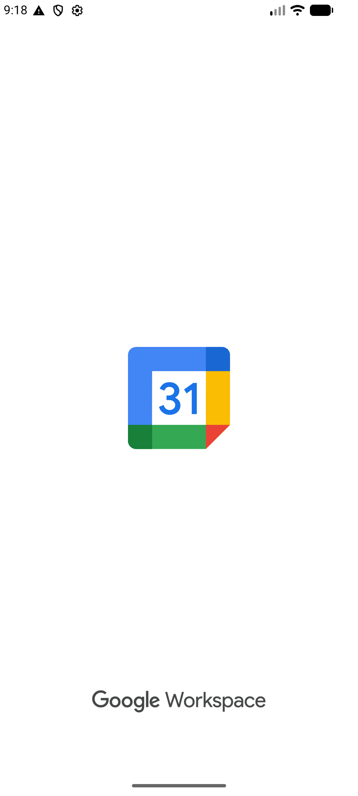

# ProWallet

Aplicación Android de gestión de gastos personales desarrollada como proyecto universitario para la materia de Desarrollo de Aplicaciones Móviles — **UNDEF**.

## Integrantes

| Nombre | GitHub |
|---|---|
| Joaquin Contreras | [@joacoContreras](https://github.com/joacoContreras) |
| Martin Gonzalez | [@mgonzalez309-dev](https://github.com/mgonzalez309-dev) |

---

## Funcionalidades principales

- **Registro e inicio de sesión** con persistencia de sesión entre reinicios (DataStore) y contraseñas hasheadas con PBKDF2
- **Registro de compras** con tienda, fecha, hora, categoría y lista de productos — guardadas en Room
- **Historial completo** de compras con total acumulado
- **Dashboard** con gasto mensual, presupuesto restante y barra de progreso en tiempo real
- **Comparación de precios** en el detalle de cada compra, consultando precios de referencia desde **Precios Claros** (API oficial del gobierno argentino) según la ubicación GPS del dispositivo — aplica un sistema de scoring por relevancia textual y popularidad de sucursales para seleccionar el producto más representativo, y muestra rango mínimo–máximo indicando si el precio pagado fue bueno, justo o alto
- **Estadísticas mensuales**: gasto total, ticket promedio, gráfico de tendencia de 6 meses y productos más comprados
- **Top tiendas**: ranking de comercios por gasto total
- **Ubicación de compra** guardada automáticamente al registrar una compra (GPS vía FusedLocationProviderClient)
- **Compartir compra** vía Intent nativo de Android (WhatsApp, Gmail, etc.)
- **Gestión de categorías** con AlertDialog de CRUD (agregar, editar, eliminar)
- **Presupuesto mensual** configurable, persistido en DataStore
- **Recuperación de contraseña** con flujo de verificación de código de 6 dígitos
- **Interfaz en Español**

---

## Descargar APK

**[⬇ Descargar ProWallet v1.0.0](https://github.com/joacoContreras/ProWallet/releases/tag/v1.0.0)**

> Requiere Android 8.0+ (API 26). Activar *"Instalar desde fuentes desconocidas"* antes de instalar.

---

## Capturas de pantalla

### Flujo de autenticación
| Splash | Login | Registro | Home |
|---|---|---|---|
|  |  |  |  |

### Registro y detalle de compras
| Nueva Compra | Compra guardada | Detalle | Historial |
|---|---|---|---|
|  |  |  |  |

### Estadísticas y perfil
| Analíticas | Top Tiendas | Perfil | Configuración |
|---|---|---|---|
|  |  |  |  |

---

## Stack tecnológico

- **Kotlin** + **Jetpack Compose** (Material 3)
- **Navigation Compose** — navegación declarativa entre 25 pantallas
- **ViewModel** + **StateFlow** — arquitectura MVVM, un ViewModel por pantalla
- **Room** — base de datos local (usuarios, compras, productos, categorías, cuentas, gastos fijos)
- **DataStore Preferences** — persistencia de sesión, presupuesto mensual y preferencias entre reinicios
- **Coroutines** + **Flow** — operaciones asíncronas con `viewModelScope`, patrón Single Source of Truth
- **Retrofit** + **Gson** — dos clientes independientes: npoint.io (catálogo de productos) y Precios Claros via CloudFront (precios de referencia por ubicación GPS)
- **FusedLocationProviderClient** — ubicación GPS con puente `suspendCancellableCoroutine` para coroutines
- **PBKDF2WithHmacSHA256** — hash seguro de contraseñas con salt aleatorio (65.536 iteraciones)
- **compileSdk 35 / minSdk 26** (Android 8.0+)

---

## Arquitectura

### Capas y flujo de datos

```
UI (Jetpack Compose)
  └── collectAsStateWithLifecycle()
        └── ViewModel (StateFlow / UiState)
              └── viewModelScope.launch { }
                    └── Repository (fuente de verdad única)
                          ├── Room DAO  ←  Single Source of Truth
                          │     └── Flow<List<T>>  →  emite automáticamente al cambiar
                          └── Retrofit  ←  solo cuando Room está vacío (cache-first)
                                └── insertAll() en Room → Flow emite → UI actualizada
```

### Patrón Single Source of Truth (Room + Retrofit)

La UI nunca consume Retrofit directamente. El flujo es:

1. `HomeViewModel.init` llama `repository.refreshApiProductsIfEmpty()`
2. `AppRepository` consulta `productDao.getProductCount()`
3. Si Room **tiene datos** → retorna inmediatamente, sin red
4. Si Room **está vacío** → Retrofit descarga el catálogo → `productDao.insertAll()` → Room persiste
5. `apiProductsFlow` (Flow de Room) emite la lista actualizada → UI reacciona automáticamente

Este patrón garantiza que la app funciona **sin conexión** después del primer arranque.

### Transacciones atómicas

Las operaciones de guardado usan `@Transaction` para garantizar atomicidad:

```kotlin
db.withTransaction {
    purchaseDao.insert(...)       // 1 insert en purchases
    purchase.products.forEach {
        productDao.insert(...)    // upsert por código UNIQUE
        purchasedItemDao.insert(...)  // N inserts en purchase_items
    }
    // Si falla cualquiera → rollback total
}
```

### ViewModel por pantalla

Cada pantalla tiene su propio ViewModel con un `UiState` sellado:

| ViewModel | Responsabilidad |
|---|---|
| `AuthViewModel` | Login, registro, recuperación de contraseña, PBKDF2 hashing |
| `HomeViewModel` | Gasto mensual, presupuesto, compras recientes, seed de Room |
| `PurchaseViewModel` | Formulario de compra, CRUD de categorías, guardado con transacción |
| `PurchaseDetailViewModel` | Detalle de compra + comparación de precios vía PreciosClaros (async/awaitAll) |
| `AnalyticsViewModel` | Tendencia 6 meses, top stores, distribución de categorías |
| `HistoryViewModel` | Listado completo de compras |
| `TopStoresViewModel` | Ranking de tiendas por mes actual |
| `StoreDetailViewModel` | Detalle de tienda mes actual vs mes anterior |
| `SettingsViewModel` | Dark mode, biométrico (DataStore) |
| `MonthlySetupViewModel` | Presupuesto e ingreso mensual (DataStore) |
| `AutoSavingsViewModel` | Porcentaje y frecuencia de ahorro (DataStore + Flow combine) |
| `AccountViewModel` | CRUD de cuentas bancarias |
| `FixedExpensesViewModel` | CRUD de gastos fijos recurrentes |

### Estructura de paquetes

```
com.undef.prowallet
├── data/
│   ├── dao/                        ← UserDao, PurchaseDao, ProductDao, PurchasedItemDao, CategoryDao
│   ├── remote/
│   │   ├── ProductDto.kt               ← DTOs: npoint.io + PreciosClarosProductDto / PreciosClarosResponse
│   │   ├── ProductApiService.kt        ← interfaz Retrofit (npoint.io)
│   │   ├── RetrofitClient.kt           ← cliente npoint.io (singleton)
│   │   ├── PreciosClarosApiService.kt  ← interfaz Retrofit (Precios Claros)
│   │   └── PreciosClarosClient.kt      ← cliente Precios Claros (singleton, base URL CloudFront)
│   ├── AppRepository.kt            ← fuente de verdad: Room + Retrofit
│   ├── ProWalletDatabase.kt        ← Room database singleton
│   ├── UserEntity.kt / PurchaseEntity.kt / ProductEntity.kt
│   ├── PurchasedItemEntity.kt / CategoryEntity.kt
│   ├── PurchaseWithItems.kt / PurchasedItemWithProduct.kt / StoreTotal.kt
├── domain/
│   └── models.kt                   ← User, Product, Purchase
├── ui/
│   ├── components/                 ← PrimaryButton, CustomTextField, TopBar, etc.
│   ├── navigation/                 ← NavGraph + sealed class Screen
│   ├── screens/                    ← una pantalla por archivo (25 pantallas)
│   └── theme/                      ← Color.kt · Type.kt · Theme.kt
├── util/
│   ├── LocaleHelper.kt             ← utilidad de idioma (API 33+ LocaleManager / AppCompatDelegate)
│   ├── LocationHelper.kt           ← FusedLocationProviderClient → suspendCancellableCoroutine → Pair<Double,Double>?
│   ├── SessionManager.kt          ← DataStore: sesión persistida entre reinicios
│   └── DateUtils.kt               ← extensiones de Purchase: isCurrentMonth(), isInMonth()
└── viewmodel/
    ├── AuthViewModel.kt            ← Room + PBKDF2WithHmacSHA256 + DataStore
    ├── HomeViewModel.kt            ← AppRepository + presupuesto mensual (DataStore)
    ├── PurchaseViewModel.kt        ← formulario de compra + persistencia Room
    ├── PurchaseDetailViewModel.kt  ← detalle + comparación de precios Precios Claros (ubicación + async/awaitAll + scoring por matchRatio y sucursales)
    ├── AnalyticsViewModel.kt
    ├── HistoryViewModel.kt
    └── TopStoresViewModel.kt
```

---

## Pantallas

| Pantalla | Ruta |
|---|---|
| Splash | `splash` |
| Login | `login` |
| Registro | `register` |
| Éxito registro | `register_success` |
| Home (Dashboard) | `home` |
| Nueva compra | `new_purchase` |
| Éxito compra | `purchase_success` |
| Detalle compra | `purchase_detail/{purchaseId}` |
| Historial | `history` |
| Estadísticas | `analytics` |
| Inflación personal | `personal_inflation` |
| Top tiendas | `top_stores` |
| Detalle tienda | `store_detail/{storeName}` |
| Perfil | `profile` |
| Configuración | `settings` |
| Gestión de cuentas | `manage_accounts` |
| Presupuesto mensual | `monthly_setup` |
| Ahorro automático | `auto_savings` |
| Chat IA | `chat_ai` |
| Notificaciones | `notifications` |
| Soporte | `contact_support` |
| Recuperar contraseña | `forgot_password` |
| Verificar código | `verify_code` |
| Nueva contraseña | `update_password` |
| Contraseña actualizada | `update_password_success` |

---

## Sistema de colores

| Token | Hex |
|---|---|
| Primary | `#A8DADC` |
| Secondary | `#457B9D` |
| Tertiary | `#F1FAEE` |
| Neutral | `#757777` |

---

## Cómo abrir el proyecto

1. Clonar el repositorio
2. Abrir **Android Studio** → `Open` → seleccionar la carpeta raíz
3. Esperar el sync de Gradle (requiere internet)
4. Correr en emulador o dispositivo con Android 8.0+ (API 26)

---

## Internacionalización

La app está actualmente en **Español**. Todos los textos visibles están en `res/values/strings.xml`.

---

## Documentación técnica

| Documento | Descripción |
|---|---|
| [`docs/networking-price-comparison.md`](docs/networking-price-comparison.md) | Flujo completo de comparación de precios via Precios Claros: clientes Retrofit, sistema de scoring, paralelismo con coroutines y lógica de badges |
